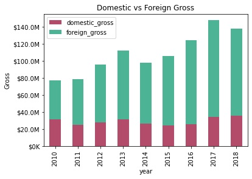
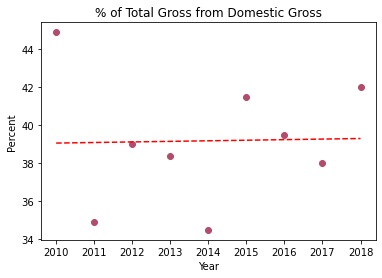
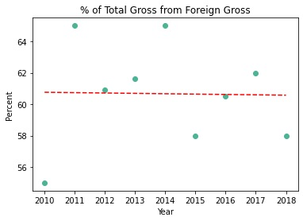
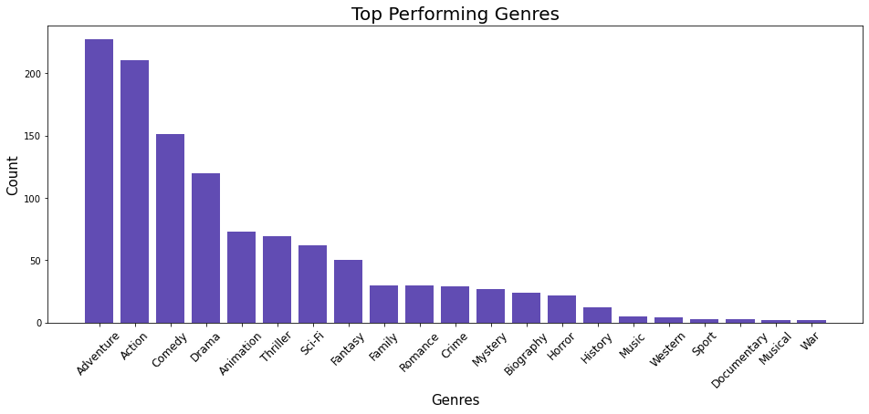

# Phase-1-Project
Git repository containing Phase 1 Project Material 
# Marketing Movies to Foreign Audiences

**Authors**: Salome Grasland

## Overview

Microsoft has launched a new movie studio and has tasked us with figuring out what kind of movies they should produce to make the most monetary impact at the box office. The data shows that the majority of profits on all movies are from foreign audiences. The baseline research showed that on average from 2010 to 2018, foreign revenue accounted for 60.8% of total revenue. The top performing movies with foreign audiences were analyzed to see what draws them in. Movies falling under the genre of adventure, action, and comedy were the most financially successful in foreign markets. Additionally, the top three production studios generating foreign revenue were 20th Century Fox Studios, BV Animation Studios, and Universal Animation Studios. In order to generate revenue Microsoft Studios should focus on foreign markets and create an adventure, action, or comedy movie and collaborate with either 20th Century Fox Studios, BV Animation Studios, or Universal Animation Studios

## Business Problem

Microsoft has just built a brand new studio and is looking to make a new movie, but they aren't sure what kind of movie to produce in order to generate the most revenue. Using data from the Internet Movie Database (IMDb) and Box Office Mojo, revenue and variables related to profits were analyzed to see what movies have generated the most revenue and what variables correlate with the most revenue. 


## Data

Data from an IMDb SQLite database and a CSV database from Box Office Mojo were used. The IMDb SQLite database contained 8 tables (persons, principals, known_for, directors, writers, movie_basics, movie_ratings, and movie_akas). The ‘movie_basics’ table was used for analysis and it contained six columns (movie_id, primary_title, original_title, start_year, runtime_minutes, and genres) and 146,144 entries. The Box Office Mojo data consisted of five columns (title, studio, domestic_gross, foreign_gross, and year) and contained 3387 entries. This data is all generated from IMDb which is the leading resource for entertainment industry professionals and a subsidiary of Amazon, consisting of over 10 million titles and over 11 million person records. Box Office Mojo was bought by IMDb in 2008 and is currently owned by Amazon. IMDb is a website that tracks box-office data for franchises, genres, actors, filmmakers, distributors, budgets, and brands, in addition to providing profiles, reviews, and summaries of entertainment series, movies, performers, and members of the production crew. These sources were used to look at quantifiable data, such as domestic and foreign movie revenues, as well as categorical data like genre and production studio. The main limitation with this data was that it only included information from the years 2010 to 2018. 

### Movie Data ERD


***

## Methods

### How Much of Total Revenue Comes From Foreign Markets
The first point analyzed represented how much of total movie revenue came from foreign markets. The Box Office Mojo Dataset was used for this analysis, as Mojo contains information on the movie’s title, production studio, domestic gross, foreign gross, and year of release. All numeric data pulled from Mojo was converted to float type, and the provided data was used to create three new columns: total gross, domestic gross as a percent of total gross, and foreign gross as a percent of total gross, the latter two given the alias ‘domestic_gross%’ and ‘foreign_gross%’. The panda method .describe() was used to pull descriptive statistics. 

The cleaned Box Office Mojo dataset was used to consider our first point– how much of total movie revenue is coming from foreign markets and how has this changed over time. The data was grouped by year to observe market trends over time and a stacked bar graph was used to compare yearly revenue generated by domestic markets versus foreign markets from 2010 to 2018. Scatter plots with trend lines were generated using values from ‘domestic_gross%’ and ‘foreign_gross%’. The trend line was included to demonstrate the consistency in revenue from domestic and foreign markets. 

### What Genre and Studios Perform Best With Foreign Markets 
The second point analyzed were variables correlated with well-performing movies in foreign markets. For a movie to be considered well-performing it had to generate a foreign revenue above the quartile 3 value of $75,050,000. The Box Office Mojo and IMDb datasets were used for this. The movie_basics table was used from the IMDb SQLite database. This table consists of six columns: ‘movie_id’, ‘primary_title’, ‘original_title’, ‘start_year’, ‘runtime_minutes’, and ‘genres’. Two columns were dropped, ‘original_title’ and ‘movie_id’, because they provided similar information to ‘primary_title’. The ‘primary_title’ column was renamed to ‘title’ to simplify merging with the Box Office Mojo dataset. Duplicate values from “title” were dropped for both the IMDb and Box Office Mojo dataset and the two datasets were merged. 

The merged data frame, called ‘df’, contained seven columns: ‘title’, ‘start_year’, ‘runtime_minutes’, ‘genres’, ‘studio’, ‘domestic_gross’ and ‘foreign_gross’ and 420 entries. All numeric data was converted to float type and a quartile 3 value of $75,050,000 was found for foreign_gross. Any movie that had a foreign gross of less than $75,050,000 was dropped from the dataframe because the business problem wants us to consider only top performing movies in foreign markets. The data was then sorted by descending foreign gross values and the panda methods .describe() was used to generate descriptive statistics. 

All missing values were dropped from ‘genres’ and spaces were added after commas. The ‘genres’ column was converted to a countable list and imported to a .txt file to make it compatible with the Counter module. 

The merged dataset from IMDb and Box Office Mojo called ‘df’ was used to consider the second question– what variables correlate with high foreign revenues. The data frame contained movies that only were in the top quartile of foreign revenue. Using the Counter module frequencies were found for ‘genres’ and ‘studio’. A bar graph was found to be the most effective mode to visually communicate the top performing ‘genres’ and ‘studios’ in foreign markets. 


## Results

Microsoft just opened a new studio and wants to know what kind of movie they should produce in order to generate max revenue. The baseline research showed that on average from 2010 to 2018, foreign revenue accounted for 60.8% of total revenue. The trendline plotted had a value of -0.02333x + 107.7, showing that foreign revenue values have remained consistent over time. Hence, the data shows that producing a movie that performs well with foreign audiences is a good strategy to generate max revenue. 

### Domestic vs Foreign Gross


### Percent of Total Revenue from Domestic Gross


### Percent of Total from Foreign Gross



The top three foreign grossing genres were ‘adventure’, ‘action’, and ‘comedy’— respectively accounting for 19.6%, 18.1%, and 13% of top performing movies in foreign markets. The top three foreign grossing studios were ‘20th Century Fox Studios’, ‘BV Animation Studios’, and ‘Universal Animation Studios,’ respectively accounting for 14.7%, 13%, and 11.9% of production for top performing movies in foreign markets. The top three performing movies in foreign markets from 2010 to 2018 were: 

1. “Avengers: Age of Ultron” produced by BV Animation Studios 
(genre: Action, Adventure, Sci-Fi)
2. “Jurassic World: Fallen Kingdom” produced by Universal Animation Studios (genre: Action, Adventure, Sci-Fi)
3. “Frozen” produced by BV Animation Studios 
(genre: Adventure, Drama, Sport)

Results are corroborated by the top three performing movies which were all produced by one of the top three performing studios in foreign markets. And all three top performing movies fell into a top performing genre category in foreign markets. Hence, the data shows that this model could with confidence benefit Microsoft Studios if implemented. 

### Top Performing Genres in Foreign Markets


### Top Performing Studios in Foreign Markets 


## Conclusions

In order to generate revenue Microsoft Studios should follow these three recommendations:

1. Focus on foreign markets because they generate the most revenue 
2. Create an adventure, action, or comedy movie and 
3. Collaborate with either 20th Century Fox Studios, BV Animation Studios, or Universal Animation Studios

While the analysis shows this a good strategy to generate revenues, Microsoft Studios may want to consider the movie's delivery methods. While foreign audiences do have the opportunity to go to the theaters, it is not as popular as in the United States. Foreign audiences rely more heavily on streaming services and physical media such as DVDs and preloaded thumb drives to access movies. Microsoft should budget for:

1. The cost of copyrighting the film for foreign streaming services and 
2. The production and delivery of physical materials 

Future considerations could also look at:

1. Production language to see if foreign audiences are more drawn to movies produced in their native tongue
2. Filming locations to see if foreign audiences are more drawn to movies filmed in familiar locations


## For More Information

For additional info, contact Salome Grasland at salome.grasland@gmail.com 

## Repository Structure

```
├── README.md                           <- The top-level README for reviewers of this project
├── Phase 1 Project Notebook.ipynb      <- Narrative documentation of analysis in Jupyter notebook
├── Phase 1 Project Presentation.pdf    <- PDF version of project presentation
├── data                                <- Both sourced externally and generated from code
└── images                              <- Both sourced externally and generated from code
```
